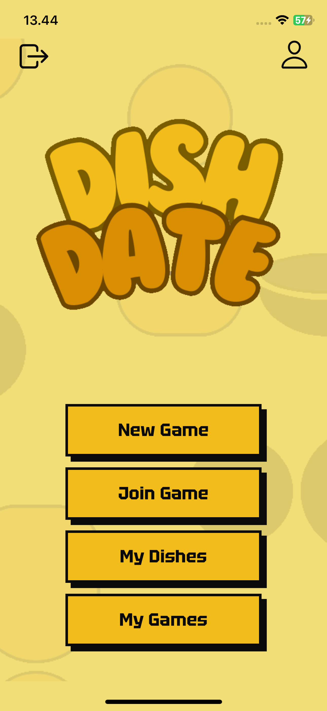
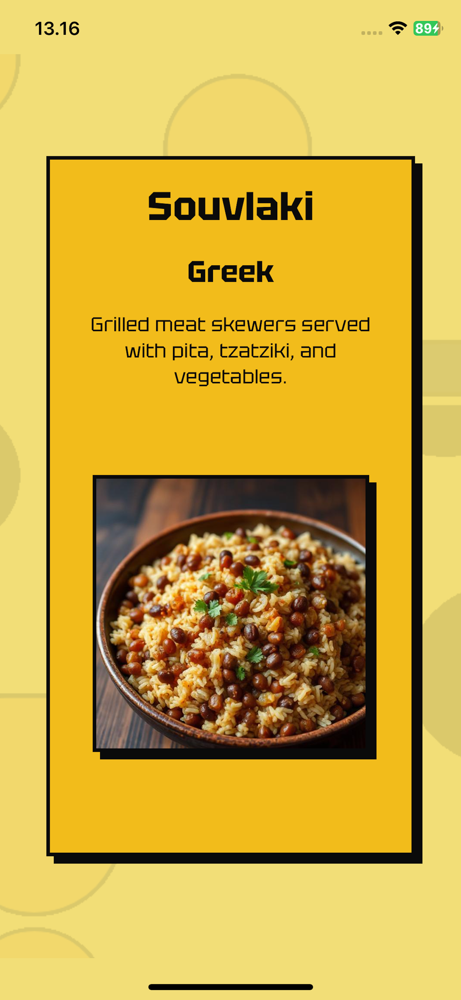
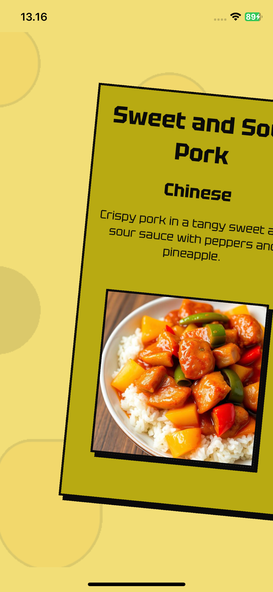
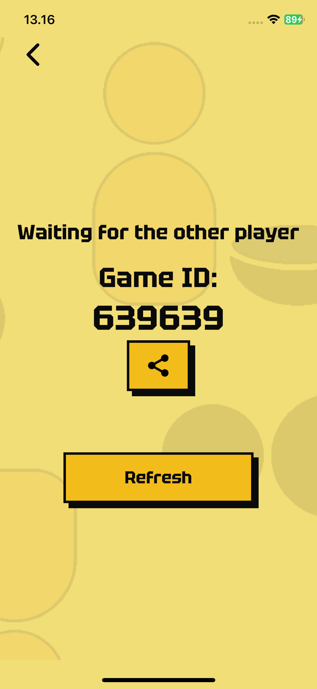

# DishDate

**DishDate** is a fun, interactive app where two users (or more in the future) go through a set of dish cards, swiping left or right based on their preferences. The app then shows how many dishes they both liked, helping people bond over shared tastes in food.

Avaliable on Play Store and App Store !

<p align="center">
  
  
  
</p>
<p align="center">
  
  
    
</p>

## 🔗 Quick Links

- [🚀 Features](#features)
- [🧩 Tech Stack](#tech-stack)
- [🛠️ Installation & Setup](#setup)
- [📖 How to Use](#how-to-use)
- [🤝 Contributing](#contributing)

<a id="features"></a>

## 🚀 Features

- 👉 Swipe-to-Choose — Browse dish cards and swipe left or right based on your taste preferences.
- 🤝 Instant Match Results — See how many dishes you and your partner both liked after each game.
- 🗂️ Custom & Community Dishes — Add and edit your own dishes or explore the growing DishDate database.
- 🎮 Multiplayer Mode — Play with another user (with support for more players in the future).
- 📜 Game History — View past matches, results, and shared favorites anytime.
- 👤 Personal Profiles — Customize your profile and track your food preferences.
- 🔍 Smart Filtering — Filter dishes by cuisine, category, or dietary preferences.
- ☁️ Cloud Sync — Securely store your data and access your games across devices.

<a id="tech-stack"></a>

## 🧩 Tech Stack

- **Frontend:** React Native
- **Backend / Auth / DB:** Supabase

<a id="setup"></a>

## Installation

### 1. Clone the repository

```bash
git clone [https://github.com/koleks92/DishDate.git](https://github.com/koleks92/DishDate.git)
cd DishDate
```

### 2. Install dependencies

```
npm install
```

### 3. Configure Environment Variables

Create a file named `.env.local` in the root directory and add your credentials:

```
EXPO_PUBLIC_SUPABASE_URL=
EXPO_PUBLIC_SUPABASE_PUBLISHABLE_KEY=
EXPO_PUBLIC_WEBCLIENT_ID=
EXPO_PUBLIC_IOSCLIENT_ID=
```

### Important

Make sure that your Supabase, Google Auth and Apple auth are configured properly !

### 4. Create development build 

Using EAS:

- ```eas build --profile development --platform android```
- ```eas build --profile development --platform ios```

Using EAS locally:
- `eas build --profile development --platform android --local`
- `EXPO_NO_CAPABILITY_SYNC=1 eas build --profile development --platform ios --local`

If problem with provisioning profile on iOS use prefix:
- `EXPO_NO_CAPABILITY_SYNC=1`

To get SHA:
- `eas credentials`

See https://docs.expo.dev/build-reference/local-builds/

<a id="how-to-use"></a>

## 📖 How to Use

TODO !

<a id="contributing"></a>

## 🤝 Contributing

Contributions are welcome! Please feel free to submit a Pull Request.


